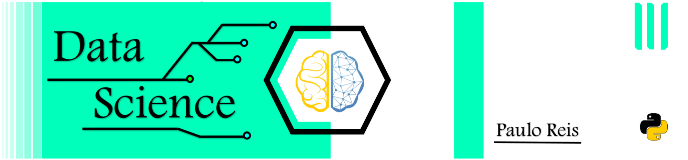

 

  

# Paulo Reis
*Future Data Scientist*

I'm in a journey trying to learn all kinds of techniques to torture data till it confesses.
And as a beginner, I want to share some projects that helped me practicing and learning new knowledge.

**Background in:** loading...

**Links:**
* [LinkedIn](https://www.linkedin.com/in/paulo-reis-b1a2101b1/)

## Projects:
* **P1:** No_link_for_now
* **P2:** No_link_for_now

---

[Checklist for Data Science Projects](https://github.com/pauloreis-ds/Paulo-Reis-Data-Science/blob/master/Checklist%20for%20Data%20Science%20Projects.ipynb)
