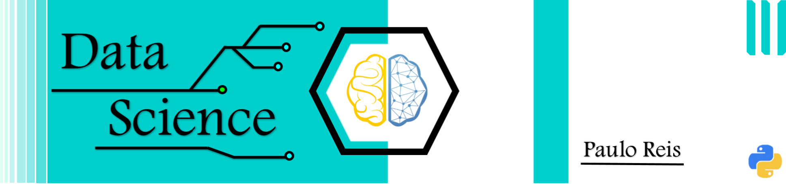

 
 

  

# Paulo Reis
*Future Data Scientist*

I'm in a journey trying to learn all kinds of techniques to torture data till it confesses.
And being a beginner, I share some practices that help me learning new knowledge.

**Background in:** loading...

**Links:**
* [Blog] loading...
* [LinkedIn] loading...

## Projects:
* **Beginner data analysis sheet cheat:** https://github.com/pauloreis-ds/Beginner-data-analysis-sheet-cheat
* **How to handle missing data - Data Science:** https://github.com/pauloreis-ds/How-to-handle-missing-data

---
